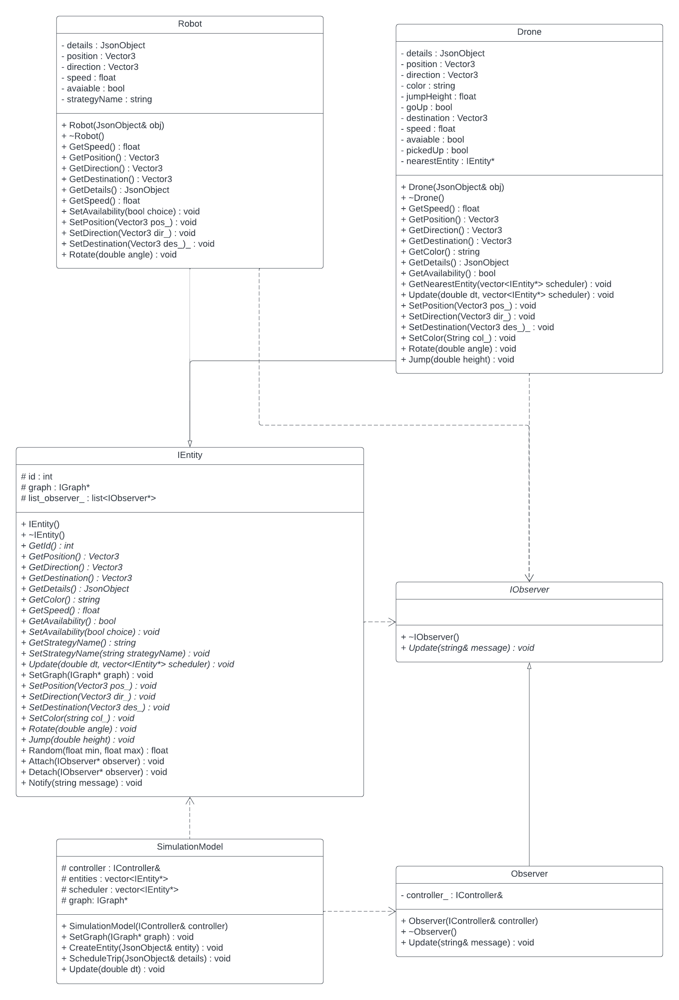

# Team-010-25-homework4
Henry Zhao - zhao1057
Kinsey Miller - mill8744
Ash Kuroki - kurok011
Joel Nathe - nathe031

### Project Overview
This project features a frontend written in HTML and JS which communicates with lower-level algorithms written in C++. When it is run, it provides two web-pages: index.html which displays a 3D rendering, and schedule.html which provides a user interface for scheduling trips. The rendering consists of a background modeled after the UMN-TC campus, where various entities are either spawned automatically when the simulation starts or generated at the user’s request. The two main entities are drones and robots, which simulate a ride-sharing environment where drones are delivered by robots to their destinations. 

### How to run
1. Open a Terminal window
1. Enter `cd <path to the folder containing this README>`
1. Compile the code using `make -j`
1. Run  the code using `./build/bin/transit_service 8081 apps/transit_service/web/`
1. Access the simulation at the URL http://127.0.0.1:8081
1. Schedule a new trip at the URL http://127.0.0.1:8081/schedule.html

### Simulation
The main focus of this simulation is using drones to deliver robots from one location to another. Each time a trip is scheduled, a robot is spawned, and a nearby drone must fly to that robot and take it to that destination. The drone by itself can fly high above the buildings, so it travels to its passenger in a straight line (i.e. beeline strategy.) But when carrying a robot, the drone may only travel along roads, which makes for more complicated paths. These paths can be calculated using the A*, Dijkstra, or DFS strategy, according to what the user selected when they scheduled a trip. Once the drone and robot arrive at the destination, the drone drops off the robot and is now available to serve other passengers. Aside from the ride-sharing, the simulation also contains a helicopter which travels through the sky towards a random destination, and humans who travel along roads toward random destinations.

### New Feature - Notifications (Observer)
In order to give more comprehensive information to users and make debugging easier for developers, a scrollable text box on the left logs every action taken by every entity. Whenever an entity is instantiated, an observer subscribes to the entity and displays notifications from the entity onto the screen. Not only is this observer pattern a useful feature in and of itself, it also makes it easy for future developers to also route notifications to other destinations if necessary, such as to the console or through HTTP messages to another host. Although we only attach one observer to each entity in this implementation, the entities are still capable of handling multiple observers, which makes this feature open to extension. 

### New Feature - Data Collection (Singleton)

### Sprint Retrospective
Some parts of the sprint went well, and some could have been better. On the plus side, we worked efficiently as a team and achieved our goals ahead of schedule. There was frequent communication between team members, so that we all knew what the others were doing and did not get in one another’s way. The code that we wrote works as expected. On the other hand, our GitHub repository has not been well-organized. There is no convention for naming branches or commits, and many of them are just groups of unrelated changes without a coherent focus. This would make it difficult to go back and debug our code if we had to. For future sprints, we should aim to not only write working code, but also do it in a way that’s methodical and coherent. For example, having each branch focused on one task, rather than many branches that span many unrelated tasks.
